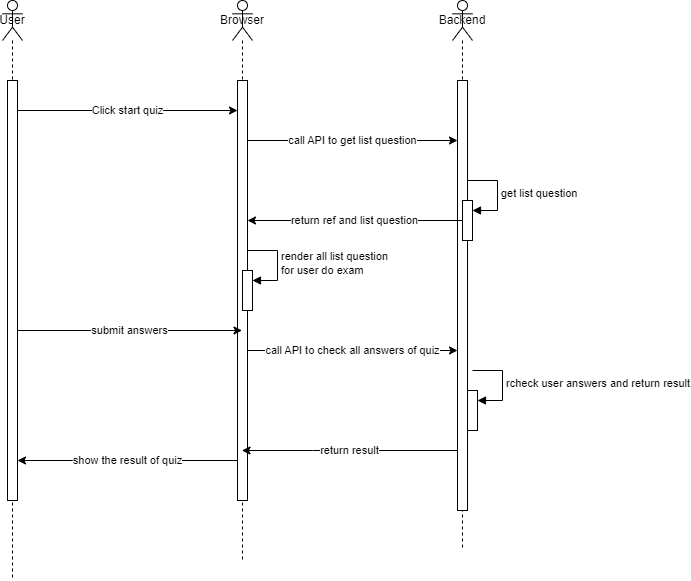

# The API For User take the exam in the web

## Sequence Diagram



***
## APIs in features:

1. **start quiz API**. 

    `POST`: /lectures/{lectureId}/start-quiz
    <br>
    <br>
    ***Path variables***
    <br>
        - lectureId - `int`: the id of lecture in course, 
    <br>
    <br>
     ***Response Body***
    ```json
    {
    "errorCode": "",
    "status": "200",
    "message": "",
    "data": {
        "refStat": "The Ref should be stored and reuse when submit quiz",
        "questions": [
            {
                "createDate": "",
                "updateDate": "",
                "id": "ID of question",
                "quizId": "ID of QUIZ",
                "offset": "INTEGER - for sort question",
                "content": "THe content of question",
                "questionType": "CHOOSE_ONE | MULTI_CHOOSE",
                "options": [
                    {
                        "createDate": null,
                        "updateDate": null,
                        "id": "ID of option for question",
                        "questionId": "Question Id",
                        "content": "the content of option"
                    }
                ]
            }
        ]
    }}

2. ***API submit and get result quiz***.

    ***POST***: lectures/{lectureId}/submit-answers

    ***Request body***
    ```json
    {
    "ref": "0da05a85-b400-4f8a-b009-4e9338eeec34",
    "userAnswers": [
        {
            "questionId": 1,
            "choose": [
                1
            ]
        },
        {
            "questionId": 2,
            "choose": [
                4
            ]
        }
    ]}

- `userAnswers`: the list answers of user for all question in QUIZ
- `choose`: list of options choose by user, if the question tye is `CHOOSE_ONE`, it should be one element in list. And `MULTI_CHOOSE` can have a lot of elements
- `ref`: for stored the result of quiz for user
<br>
<br>
***Response body***
    ```json
    {
    "errorCode": "",
    "status": "200",
    "message": "",
    "data": {
        "ref": "0da05a85-b400-4f8a-b009-4e9338eeec34",
        "lectureId": 29,
        "username": "toanpt",
        "passed": true,
        "numCorrect": 1,
        "numWrong": 1,
        "checked": [
            {
                "questionId": 1,
                "userAnswers": [
                    1
                ],
                "correctAnswers": [
                    1
                ],
                "whyCorrect": [
                    "yes yes"
                ],
                "correct": true
            },
            {
                "questionId": 2,
                "userAnswers": [
                    4
                ],
                "correctAnswers": [
                    3,
                    4
                ],
                "whyCorrect": [
                    "nulti",
                    "multi"
                ],
                "correct": false
            }
        ]
    }}

- `checked`: the result of each question
- `userAnswers`: the option was choose by user
- `correctAnswers`: the result was given by teacher
- `whyCorrect`: show more about why this is correct
- `correct`: show that the user answer the question correct or not